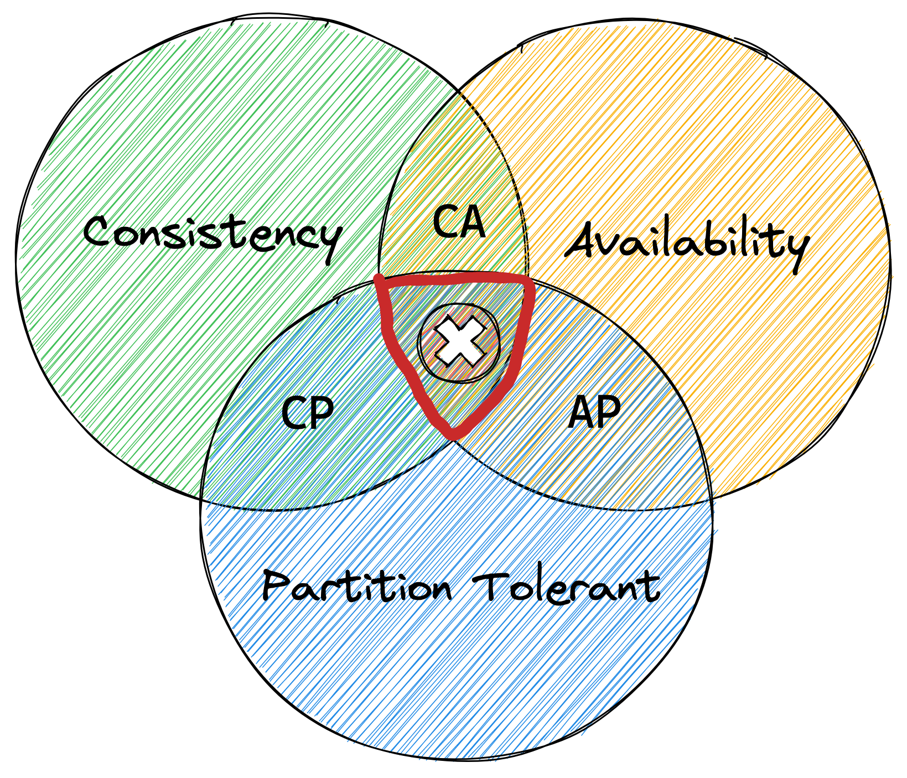

# Database Transaction Model

Dalam membangun sebuah aplikasi atau sistem, database biasanya menjadi salah satu elemen yang vital. Dan menentukan database yang tepat bisa menjadi sebuah hal yang rumit dan tricky. Ada banyak ragam database yang bisa kita pilih dan gunakan. Namun sebelum kita memutuskan pilihan, kita harus tahu dan paham secara mendalam dulu kebutuhan kita akan database tersebut seperti apa.

Hal pertama yang (seharusnya) kita lakukan biasanya adalah menentukan model transaksi yang akan digunakan di database nanti seperti apa. 

Model transaksi database itu (_database transaction model_) sendiri adalah sebuah kumpulan aturan yang mendefinisikan dan menentukan bagaimana database mengatur, menyimpan, dan memanipulasi data. Nah, pada dasarnya ada 2 macam model yang dikenal dalam _database transaction model_ yaitu ACID dan BASE. 

.

Dalam Teorema Brewer/CAP terkait arsitektur sistem terdistribusi (_distributed system_), kita tidak mungkin mencapai _consistency_ plus _availability_ dalam sebuah sistem terdistribusi yang _partition tolerant_. Pilihannya hanya: 
- _consistency_ + _partition tolerant_, atau 
- _availability_ + _partition tolerant_.

Sebuah _partition_ adalah putusnya komunikasi dalam sebuah _distributed system_- putus koneksi atau karena ada _delay_ koneksi antara 2 titik atau lebih. _Partition tolerance_ berarti _distributed system_ tersebut mampu untuk tetap bekerja telepas ada berapa banyak gangguan koneksi yang terjadi antar titik di sistem tersebut.

Nah perbedaan mendasar antara model database ACID dan BASE adalah cara mereka mengatasi limitasi kondisi di atas.

## ACID database transaction model
.
#### - Atomic
Setiap transaksi yang terjadi ini harus __SUKSES SEMUA__ atau __GAGAL SEMUA__. Hal ini akan memastikan semua data yang ada dalam database valid.

#### - Consistentcy
Transaksi yang diproses tidak akan membahayakan integritas struktural database. Termasuk di dalamnya semua _rules_, _constraints_ serta _triggers_. Jika ada data yang kondisinya tidak sesuai (_illegal state_) maka transaksi tersebut akan gagal.

#### - Isolation
Isolasi di sini terkait dengan kegagalan dalam satu transaksi tidak boleh mempengaruhi transaksi lainnya. Sejauh mana efek sebuah transaksi dapat dipengaruhi oleh transaksi lainnya.

#### - Durability
Data yang terkait dengan transaksi yang selesai akan tetap ada meskipun ada gangguan pada jaringan, server crash atau mungkin aliran listrik. Jika transaksi gagal, dia tidak akan mempengaruhi data yang telah dimanipulasi.

**ACID** fokus pada _consistency_. Relational database (RDBMS) seperti MySQL, PostgreSQL, Oracla, Ms SQL adalah contoh database ACID-_compliant_. Beberapa document-db seperti halnya CouchDB, MongoDB juga ACID-_compliant_ pada tahapan tertentu. 

Untuk _usecase_, institusi keuangan atau transaksi finansial hampir semuanya pasti menggunakan ACID database. Karena transaksi keuangan sangat tergantung dengan _atomic_-nya ACID.

## BASE database transaction model
.
BASE fokus pada _high availability_.

#### - Basically Available
Memastikan ketersediaan data dengan cara menyebar dan mereplikasinya ke semua node yang ada dalam _database cluster_. Fungsi _read_ dan _write_ tetap akan bisa diakses namun tidak ada jaminan akan konsistensi datanya. Jadi ada kemungkinan proses _read_ tidak memberikan data yang terbaru atau proses _write_ tidak 

#### - Eventually Consistent
Agak dibalik dikit. E duluan sebelum S karena sebenarnya S adalah turunan dari E.

Hanya karena BASE tidak memaksakan adanya _immediate consistency_ seperti ACID, bukan berarti datanya tidak akan pernah konsisten. Data akan menjadi konsisten seiring dengan berjalannya waktu.

Maksudnya, karena semua transaksi terjadi tanpa harus menunggu satu sama lainnya selesai serta tidak adanya isolasi hal ini akan menimbulkan  multi-direction flow perubahan data pada record yang sama. Dan mempertimbangkan pada suatu waktu record yang sama ini tidak akan lagi mendapatkan update lagi maka di titik itulah konsistensi data akan terjadi.

#### - Soft State
Di dalam BASE model, database harus mengurusi konsistensinya sendiri. Karena kondisi/state/data sistem akan terus berubah seiring saat dia menerima informasi baru. Dalam konteks ini, tugas untuk memastikan konsistensi data tentunya didelegasikan ke developer aplikasi.

No. | Parameters | ACID | BASE |
----|------------|------|---------------------|
1. | Scaling | Provides Vertical Scaling | Provides Horizontal Scaling |
2. | Consistency | Strong Consistency | Weak Consistency – Stale Data OK |
3. | Isolation | Strong Isolation | Last Write Wins, availability first |
4 | Availability | Less Availability | Aggressive (optimistic) |
5. | Maintenance | Require more maintenance | Require less maintenance |
6. | Cost | High Maintenance Cost | Low Maintenance Cost |
7. | Implementation | Easy to implement | Difficult to implement |
8. | Upgradation | Difficult to upgrade | Easy to upgrade |
9. | Focus | Focuses on Commit | Focuses on Best Efforts |
10.| Database Type | Robust database | Simple database |
11. | Joins and Relationship | Expensive Joins and Relationship | Free from joins and Relationship |
12.| Time | Require less time for completion | Require more time for completion |
13.| Concurrency scheme | Nested Transactions | Approximated Answers |
14.| Code Type | Simple code | Harder code |

Referensi:
- https://en.wikipedia.org/wiki/Database_transaction
- https://en.wikipedia.org/wiki/ACID
- https://en.wikipedia.org/wiki/Eventual_consistency
- https://en.wikipedia.org/wiki/CAP_theorem
- [Proof of CAP Theorem, Brewers Conjecture](https://users.ece.cmu.edu/~adrian/731-sp04/readings/GL-cap.pdf)
- [Martin Kleppman, _Designing Data-Intensive Applications_, O'Rielly, 2017](https://www.oreilly.com/library/view/designing-data-intensive-applications/9781491903063/?_gl=1*uwxekd*_ga*MTEyNzY1NzA2MC4xNjc1MDU0MTA1*_ga_092EL089CH*MTY3NTA1OTczNi4yLjAuMTY3NTA1OTc0MC41Ni4wLjA.)
