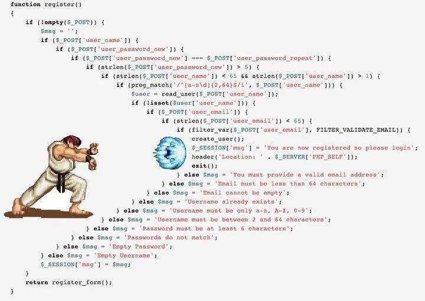

# Object Calisthenics


Selama 2022 lalu saya berkesempatan terlibat dalam project Way of Working (WoW) di tim MyTelkomsel bersama dengan Thoughtworks. Salah satu _stream_ di project tersebut kami sebut sebagai _Dev Champions_. Di sini kita mencoba memperkenalkan hingga menerapkan banyak hal terkait dengan best practice software engineering di keseharian sebagai software developer, programmer. Tujuannya tentu sudah jelas yaitu untuk meningkatkan kualitas kesisteman yang kita bangun. Banyak hal-hal yang dasar (_basic_) namun mendasar (_fundamental_) yang kita pelajari di sini. 

Salah satu yang akan coba share di tulisan ini adalah __Object Calisthenics__. 

_Object Calisthenics_ di sini pada dasarnya terkait latihan-latihan (yang nantinya akan membentuk kebiasaan) dalam menulis program. Ada 9 aturan yang dirumuskan oleh Jeff Bay di buku The ThoughtWorks Anthology (Chapter 6). 

Aturan-aturan ini berfokus kepada peningkatan kualitas _maintainability, readability, testability dan comprehensibility_ source code yang kita tulis. Dengan mengikuti aturan-aturan ini nantinya akan mengubah cara kita menulis program secara natural. 

Terus, apakah _Object Calisthenics_ ada hubungannya dengan _SOLID principle_ yang juga berfokus pada _maintainability, readability, testability dan comprehensibility_?  

Ada. SOLID fokus kepada dependency management. Sementara Object Calisthenics fokus ke solusi yang memungkinkan dependency management tersebut dapat terimplementasi. Dengan begitu _maintainability, readability, testability dan comprehensibility_ akan bisa pula tercapai.

Nah, 9 aturan _Object Calisthenics_ tersebut adalah:
- _Only One Level Of Indentation Per Method_
- _Don’t Use The ELSE Keyword_
- _Wrap All Primitives And Strings_
- _One Dot Per Line_
- _Don’t Abbreviate_
- _Keep All Entities Small_
- _No Classes With More Than Two Instance Variables_
- _First Class Collections_
- _No Getters/Setters/Properties_

**1. Only One Level Of Indentation Per Method**
Contoh dari Jeff Bay seperti berikut:
```
class Board {
    ...
    ...
    public String board() {
        StringBuilder buf = new StringBuilder();

        // 0
        for (int i = 0; i < 10; i++) {
            // 1
            for (int j = 0; j < 10; j++) {
                // 2
                buf.append(data[i][j]);
            }
            buf.append("\n");
        }

        return buf.toString();
    }
}
```
Pada pseudo code di atas, method board mempunyai 2 level loop di dalamnya. Setiap loop walau sepintas nampak melakukan hal yang "sama", namun tugas keduanya sebenarnya berbeda.

Loop paling dalam (#1) akan melakukan append data (#2) dalam 1 baris yang sama.
Loop terluar (#0) akan melakukan append data dari semua baris yang ada dengan penambahan karakter new line di setiap akhir baris yang selesai dibaca.

Punya terlalu banyak level indentation di code kita ini bisa bikin puyeng bacanya. Kalo baca saja sudah puyeng maka _maintainability_ juga akan susah. Karena ga sekedar memmbaca saja, seringnya kita meng-"_compile_" untuk dapat mengerti alurnya. Terlebih kalo di code tadi punya berbagai kondisi di level yang berbeda, if dalam if atau loop dalam loop seperti contoh di atas.

Nah aturan _One Level Indentation_ ini mencoba untuk memaksa kita untuk menulis method yang hanya punya 1 level indentation (secara harfieh) yang hanya bertugas mengerjakan 1 hal saja. Karena method yang puya banyak level indentation seringnya akan punya banyak level abstraksi juga. Dengan method yang kecil, akan besar kemungkinan kita banyak reuse code dan juga mengurangi potensial duplikasi code itu sendiri.

Nah, kalau begitu bagaimana cara kita membuat method di atas menjadi _one level indentation_?

Ada sebuah metode/cara yang disebut sebagai [_Extract Method Pattern_](https://refactoring.com/catalog/extractFunction.html) yang dapat kita gunakan. Kalian bisa baca lebih lanjut mengenai metode ini di buku [_Refactoring: Improving the Design of Existing Code_](https://martinfowler.com/books/refactoring.html) karya Martin Fowler.

Jadi sesuai namanya, kita akan extract beberapa fungsi yang ada di method board() di atas menjadi beberapa method yang independen.

```
class Board {
    public String board() {
        StringBuilder buf = new StringBuilder();

        collectRows(buf);

        return buf.toString();
    }

    // collect data dari semua rows/baris yang ada
    private void collectRows(StringBuilder buf) {
        for (int i = 0; i < 10; i++) {
            collectRow(buf, i);
        }
    }

    // collect data dari 1 baris saja
    private void collectRow(StringBuilder buf, int row) {
        for (int i = 0; i < 10; i++) {
            buf.append(data[row][i]);
        }

        buf.append("\n");
    }
```

Mirip dengan prinsip Single Responsibility Principle di SOLID kan?

**2. Don’t Use The ELSE Keyword**
Lho, pake IF tapi ga boleh ada ELSE. Maksudnya apa, nih?
Nah perhatikan meme di bawah ini? Namanya "indent hadouken", masih berhubungan dengan aturan nomor 1 di atas.



Kita pasti pernah menulis code seperti itu. Apakah mudah di baca? Sepintas mungkin mudah karena ditulisnya "rapi" dengan indent yang jelas. Tapi apakah yakin "enak" dibaca dan juga mudah dimengerti? Hehehehehe. 

IF/ELSE ini bisa dibilang ada di semua bahasa pemrograman jadi memang susah dihindari untuk tidak memakai ELSE. Karena lebih mudah nambah ELSE dibandingkan refaktor ke logic yang lebih baik. Bukannya "bagus", code kita ada akhirnya malah berakhir "jelek". Ga enak dibaca, sudah dipahami, dan bisa berakibat performa tidak optimal.

Contoh:
```
func login($username, $password) {
    if ($this->user_service->is_valid($username, $password)) {
        redirect("mainpage");
    } else {
        $this->session->set_flashdata(("error", "Incorrect username/passsword");
        redirect("login");
    }
}
```

Kita bisa menggunakan mekanisme _early return_ untuk menghilangkan else dari pseudo contoh di atas.
```
func login($username, $password) {
    if ($this->user_service->is_valid($username, $password)) {
        return redirect("mainpage");
    } 

    $this->session->set_flashdata(("error", "Incorrect username/passsword");
    return redirect("login");    
}
```

Variasi lainnya semisal dengan penggunaan variabel.
```
func login($username, $password) {
    $route_target = "mainpage";
    if (!$this->user_service->is_valid($username, $password)) {
        $this->session->set_flashdata(("error", "Incorrect username/passsword");
        $route_target = "login";
    } 

    return redirect($route_target);
}
```
Selain itu, dalam konteks OOP, kita juga bisa memanfaatkan beberapa design pattern OOP untuk menghindari pemakaian ELSE ini. Contoh, jika  kita harus menentukan action berdasarkan status (semisal STARTING, RUNNING, WAITING, CLOSING, CLOSED. Atau anggap saja state-nya seperti state TCP deh) dari pada pake if/else kita bisa pakai [_State Pattern_](https://sourcemaking.com/design_patterns/state) untuk enkapsulasi berbagai perilaku untuk sebuah rutin yang sama berdasarkan status object-nya.

Selain itu Null Object maupun Strategy pattern atau bahkan polymorph juga bisa dimanfaatkan sesuai dengan usecase-nya.

**3. Wrap All Primitives And Strings**
Kita harus mengenkapsulasi semua primitf yang ada dalam object. Kalau ada variabel dengan tipe data primitif tapi punya [_behavior_]() (fungsi), maka kita perlu meng-enkapsulasi-nya.
Tujuannya supaya ga terjadi [_Primitive Obsession_]().

Oh iya, tipe data primitif di sini ga cuman byte, short, int, long, float, double, boolean dan char saja tapi termasuk juga string ya.

Contoh:
```
class Customer {
    private string firstName;
    private string lastName;
    private date birthDate;
    private string homeAddressLine1;
    private string homeAddressLine2;
    private string homeAddressCity;
    private string homeAddressProvince;
    private string homeAddressZipcode;
    private boolean informedByEmail;
    private boolean informedBySms;    
    ...
    ...
}

class Order {
    private float totalPayment;
    private string deliveryAddressLine1;
    private string deliveryAddressLine2;
    private string deliveryAddressCity;
    private string deliveryAddressProvince;
    private string deliveryAddressZipcode;

}
```
Nah, melihat contoh di atas akan lumayan ribet saat kita misalnya ingin melakukan perubahan alamat rumah atau alamat pengiriman misalnya. Karena alamat rumah vs alamat pengiriman sama-sama punya 5 field, jadi bisa ada kemungkinan nilai fieldnya tidak sengaja tertukar (misal antara *AddressLine1 vs *AddressLine2). Atau update datanya tidak lengkap karena masing-masing field nya berdiri sendiri (misal update alamat Line1 & Line2 tapi zipcode ketinggalan).

Oleh karena itu, kita perlu melakukan enkapsulasi. 
```
class Customer {
    private Person name;
    private DateOfBirth birthDate;
    private Address homeAddress;
    private Address billingAddress;
    private NotificationChannels notificationChannels;
    ...
    ...
}

class Order {
    private Money totalPayment;
    private Address deliveryAddress;
    ...    
}
...
```

Pada pseudo code di atas, pada domain Customer kita enkapsulasi firstName & lastName yang bertipe string ke dalam sebuah value object bernama Person. Object ini bisa mempunyai fungsi semisal fullName atau name yang akan menampilkan nama lengkap (firstName + lastName), atau getFirstName, getLastName. Atau kita mungkin punya tambahan properti semisal titel, status pernihakan beserta operasi untuk update datanya.

Object DateOfBirth semisal bisa mempunyai behavior menampilkan umur selain standard menampilkan tanggal-bulan-tahun secara terpisah.

Di domain Order implementasinya bisa seperti berikut
```
class Order {
    ...
    public void checkOut(Customer customer) {
        ...
        this.deliveryAddress = customer.homeAddress();
    }
}
```

**4. One Dot per Line**
_dot_ di sini adalah _dot notation_ yaitu mekanisme memanggil method dari sebuah class yang umum digunakan di banyak bahasa pemrograman seperti Python, Java, C# dan lainnya. (Kalau di PHP pakai arrow ->).
Dengan hanya menggunakan satu dot di setiap baris maka code kita akan semakin mudah dibaca dan dipahami.

Contoh multiple dots dalam satu baris:
```
class Piece {
    public String representation;
     ...
}

class Location {
    public Piece current;
    ...
}
 
class Board {
    public String boardRepresentation() {
        StringBuilder buf = new StringBuilder();

        for (Location loc : squares()) {
            buf.append(loc.current.representation.substring(0, 1)); //jeng jeng!!
        }

        return buf.toString();
    }
}
```

Dari contoh di atas, kita mungkin akan mengalami masalah atau kerancuan untuk mencari obyek mana yang semestinya bertanggung jawab melakukan sebuah aktivitas tertentu. Karena bisa saja salah tempat baik aktivitasnya ataupun tanggung jawab obyeknya.

Perhatikan baris berikut ini:
```
buf.append(loc.current.representation.substring(0, 1));
```
- Si variabel _loc_ ini mengakses _Location_ class dan property _current_ miliknya.
- Namun kemudian dia mengakses _representation_ yang merupakan milik _Piece_ class. Aktvitasnya sendiri terjadi pada _representation_ tersebut.
- Jadi yang bertugas ngutak-atik _representation_ ini sebenarnya tanggung jawab _Location_ apa _Piece_?

Terlalu banyak dot juga menunjukkan kita sudah melanggar aturan enkapsulasi.

Jika code di atas kita refaktor dengan mengikuti prinsip _Law of Demeter_, "_talk to your friend, dont talk to stranger_", maka implementasi dari _one dot per line_ akan seperti berikut:

```
class Piece {
    // private untuk proteksi, no direct access allowed
    private String representation; 

    // method untuk operasi pada private representation
    public String character() {
        return representation.substring(0, 1);
    }

    public void addTo(StringBuilder buf) {
        buf.append(character());
    }
    
}

class Location {
    // private untuk proteksi, no direct access allowed
    private Piece current;
    
    // encapsulate operasi pada Piece -> representation
    public void addTo(StringBuilder buf) {
        current.addTo(buf);
    }
}
 
class Board {
    public String boardRepresentation() {
        StringBuilder buf = new StringBuilder();

        for (Location location : squares()) {
            // location hanya ngobrol dengan Location
            location.addTo(buf); 
        }

        return buf.toString();
    }
}
```

Nah hal di atas sama kan dengan _Open/Closed Principle_ di SOLID?

Sebagai catatan, kondisi ini **tidak berlaku** untuk [Fluent Interfaces](https://martinfowler.com/bliki/FluentInterface.html) atau apapun yang mengimplementasikan [Method Chaining Pattern](https://www.geeksforgeeks.org/method-chaining-in-java-with-examples/) ya.

**5. Don’t Abbreviate**
"Kenapa perlu disingkat?"

Karena ama variable, method atau table dan kolomnya kalau panjang kok bikin capek ngetiknya ya (walau sudah ada autocomplete hehehe). Kalau disingkat lebih pendek nampaknya bisa lebih rapi dan _clean_ nih source code kita.

Apakah benar begitu? 

Karena bisa jadi kalau kita singkat-singkat, konteksnya malah tidak dapat. Jika suatu saat harus membaca ulang code yang sudah sekian lama kita buat, bisa jadi kita akan bingung sendiri karena tidak mendapat konteks dari singkatan-singkatan di dalamnya itu.

_studentAddress_ kita singkat jadi _stdAd_ ... suatu saat nanti terjemahannya bisa menjadi _standardAdvertising_.

"Jadi, kenapa perlu disingkat?"

Untuk mendapatkan konteks yang lebih jelas dan menghindari duplikasi.

Contoh, kita punya class Order, didalamnya ada method createOrder, confirmOrder, shipOrder. Di kasus ini kita bisa menyingkat nama methodnya supaya lebih sejalan dengan nama kelasnya tanpa menghilangkan kontesnya.
Dari pada Order.createOrder() atau Order.shipOrder() kita bisa menyederhanakannya menjadi Order.create() atau Order.ship()

Usahakan untuk menjaga nama kelas atau method di satu atau dua kata saja dan hindari nama yang menimbulkan duplikasi konteks.

**6. Keep All Entities Small**
Langsing jangan gemuk :)

Menurut Jeff, sebuah _class_ itu maksimal terdari dari **50 baris** dan tidak ada _package_ yang lebih dari **10 file**.

Kelas yang hanya berisi 50 baris secara visual akan lebih mudah dibaca, ga perlu scrolling-scrolling layar. Selain itu, kalo lebih dari 50 baris ada tendensi dia melakukan lebih dari 1 hal (SRP) yang nantinya akan susah dipahami dan digunakan kembali (reuse)

Aturan ini memang menantang sekali dalam penerapannya. :P

**7. No Classes With More Than Two Instance Variables**

Yang satu ini nampaknya adalah aturan yang paling susah implementasinya.

Namun tujuannya adalah melatih kita untuk lebih banyak memecah (decouple) class yang kita buat. Kita juga bisa membedakan mana class yang mengurusi _state_ dari sebuah instance variable serta mana class yang mengurusi koordinasi antara 2 variabel yang berbeda. Selain itu _high cohession_ dan enkapsulisasi kelas yang lebih baik akan tercapai.

**8. First Class Collections**
_Class_ apapun yang punya _collection_ di dalamnya maka harus dipastikan dia tidak boleh berisi _member variables_ lainnya. Jika kita punya kumpulan elemen yang ingin dimodifikasi maka kita harus membuat class khusus untuk kumpulan elemen ini.

Setiap collection dibungkus di-class-nya masing-masing, sehingga fungsi-fungsi yg terkait dengan collection tersebut punya induk (misal searching, filtering, validating, etc).

Semisal, kita punya class Cika yang butuh Rows dari Inventory. Si Bubu ini punya operasi untuk mendapatkan data urutan ke-7 dari Rows.
Beberapa waktu kemudian muncul Ciko yang butuh data nomor 12 dari Rows.
Cika dan Ciko punya implementasinya sendiri-sendiri.

Cika cika = new Cika(Inventory.getRows() )
Ciko ciko = new Ciko(cika.getRows())

InventoryRow row7 = cika.find7thRow();
InventoryRow row12 = ciko.find12thRow();

**9. No Getters/Setters/Properties**
Dikenal juga sebagai "_Tell, Dont Ask!_" .

Jika merujuk pada Martin Fowler, object-orientation adalah tentang membungkus data dengan kumpulan fungsi yang melakukan operasi atas data tersebut. Oleh karena itu pada "Tell, don't ask"

Itu istilah yang sering digunakan oleh Aru maupun Venky di kelas DevChampion untuk menyederhanakan aturan nomor 9 ini.  

Sebenarnya mungkin nggak apa-apa juga sih pake _accessors_ (getter/setter/properties) untuk mendapatkan state dari sebuah obyek, selama kita tidak menggunakan hasilnya untuk menentukan kondisi atau keputusan di luar domain obyek tersebut. Di sisi lain, _getter/setter_ juga berpotensi menimbulkan celah keamanan.


Referensi:
- [Chapter 6: Object Calisthenics by Jeff Bay, The ThoughtWorks Anthology, 2008](https://www.amazon.com/ThoughtWorks-Anthology-Technology-Innovation-Programmers/dp/193435614X)
- [Refactoring: Improving the Design of Existing Code, _Martin Fowler_](https://martinfowler.com/books/refactoring.html)
- [Domain-Specific Languages, _Martin Fowler, Rebecca Parsons_, 2010](https://martinfowler.com/books/dsl.html)
- [TellDontAsk, _Martin Fowler_, 2013](https://martinfowler.com/bliki/TellDontAsk.html)
- [Why getter and setter methods are evil, _Allen Holub_, 2003](https://www.infoworld.com/article/2073723/why-getter-and-setter-methods-are-evil.html)
- [The ThoughtWorks Anthology, 2008](https://theswissbay.ch/pdf/Gentoomen%20Library/Programming/Pragmatic%20Programmers/The%20ThoughtWorks%20Anthology.pdf)
